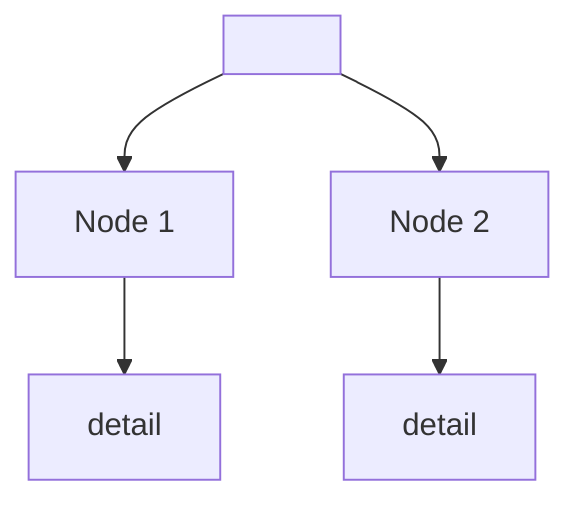
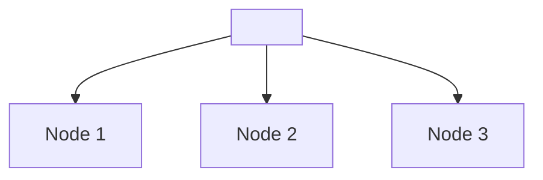

# Update Studies — YouTube → Mind Map

## Triggers

This skill has **three modes**, activated by different trigger phrases:

| Mode | Trigger phrase | Example |
|---|---|---|
| **Mode 1 — Normal playlist listing all available** | `update studies` | `update studies` |
| **Mode 2 — Playlist about a topic** | `update studies about <topic>` | `update studies about AI` |
| **Mode 3 — Direct video link, no playlist selection** | `update studies from video <url>`, `/estudos <url>`, or URL alone | `/estudos https://www.youtube.com/watch?v=abc123` |

> **Note:** Portuguese / Hermes-style triggers `atualizar estudos` and `/estudos` also work for all modes. Accept the URL **before or after** the trigger phrase (e.g. `<url> /estudos` or `/estudos <url>` both trigger Mode 3). Match all variants: `update studies`, `atualizar estudos`, `/estudos`.

---

IMPORTANT RULE:
**NEVER** process more than one video in the same conversation. One video per session.

## Mode 1 — Normal playlist

Classic interactive flow: choose playlist → choose video → process.

### Step 1 — Choose a playlist

1. List playlists from the channel using `mcp_youtube_management_youtube_get_playlists` with `channel_id=UCpFVltB83TFgign3AHLP6rA`
2. Show numbered playlists and ask: **"Which playlist do you want to use?"**

### Step 2 — Show recent videos

1. Get videos from the chosen playlist with `mcp_youtube_management_youtube_get_playlist_items`
2. Read `~/Desktop/conteudoestudos/.processed` to know which `video_id`s have already been processed
3. Show a numbered list with the most recent videos first, removing all the processed ones
4. Ask: **"Which video do you want to process? (number)"**

### Step 3 — Process the chosen video

1. Get the transcript — follow the **[Transcript Retrieval Fallback Strategy](#transcript-retrieval---fallback-strategy)** below
   - If there is **NO transcript** after trying both tools: say "⏭️ no transcript: <title>" and go back to step 2
2. Using the transcript, generate a mind map. The output must include BOTH a markdown mind map AND multiple small Mermaid treeview diagrams:

```markdown
# <Video Title>

## Mind Map
### <Main Topic 1>
- detail
- detail
### <Main Topic 2>
- detail

## Interesting Topics
- relevant concept or insight
- idea to explore later

## Tools & Technologies
- `tool` — brief usage description

## Resumo Geral
> One paragraph synthesizing the core insight of the video. What is the main takeaway? Why does it matter?

## Mind Map (Mermaid)

### <Context Group 1>


### <Context Group 2>

```

**Mermaid treeview rules:**
- BREAK into **multiple small diagrams** (4-7 nodes each) grouped by context/theme — never one giant diagram
- Each group is a logical cluster of related topics
- **Max 7 nodes per diagram** (hard limit — keeps them readable and prevents render failures)
- If a topic has 7+ sub-items, split it into 2+ diagrams
- First line must be `flowchart TD`
- **Every diagram must use UNIQUE node IDs** — use a 2-character prefix per diagram (e.g. `PQ`, `HW`, `OL`) for all nodes including the root. Never reuse `R` across diagrams. Some renderers merge consecutive blocks into one canvas; duplicate IDs cause overlapping.
- Each node: `ID["Label"]` (unique ID + quoted label)
- Connections: `ID1 --> ID2` for parent-child
- Use `### Subheading` before each diagram as its title
- Leave **2 blank lines** between the closing ` ``` ` of one mermaid block and the next `### Heading` — single blank lines let some renderers merge diagrams
- See `references/mermaid-treeview-example.md` for a concrete approved example

**Mermaid label rules (critical — failures here cause blank/invisible diagrams):**
- **NO accented characters** — replace `á`→`a`, `é`→`e`, `í`→`i`, `ó`→`o`, `ú`→`u`, `ã`→`a`, `ç`→`c`, `â`→`a`, `ê`→`e`, `ô`→`o`, `ü`→`u`
- **NO special quotes** — use straight `"` (ASCII 34), not curly/typographic quotes
- **Keep labels short** — ideally under 25 characters, hard max 40
- **Avoid emoji in labels** ✅❌ may not render in Mermaid — describe status with text (e.g. "- APROVADO" or "- FALHOU")
- **NO question marks (?), exclamation marks (!), angle brackets (< >), dollar signs ($), forward slashes (/), or tildes (~)** in labels — these break Mermaid parsers
- **NO `+` or `-` at the very start of a label** — Mermaid may interpret them as operators
- **NO parentheses `(` `)`** in labels — can be confused with Mermaid syntax
- Good: `R["O problema: ficou bom nao e avaliacao"]`
- Bad: `R["O problema: 'Ficou bom' não é avaliação?!!!!"]` — has curly quotes, accent, special chars
- Bad: `R["Resposta: <45 tok/s>"]` — angle brackets break rendering
- Bad: `R["+B = +inteligencia"]` — plus at start is risky
- Bad: `R["78 tok/s - Rapido"]` — forward slash breaks rendering
- Bad: `R["Custo ~16k USD"]` — tilde breaks rendering

**Pre-save Mermaid verification checklist** — run this on the generated Mermaid blocks BEFORE saving the file:

1. Scan every `["..."]` label in all mermaid code blocks
2. Check for: `?` `!` `<` `>` `$` `/` `~` `(` `)` `á` `é` `í` `ó` `ú` `ã` `ç` in labels — if found, rewrite without them
3. Check labels starting with `+` or `-` — rephrase to avoid leading operators
4. Confirm every diagram has ≤7 nodes (hard limit)
5. Confirm ALL node IDs are unique across all diagrams — use a 2-char prefix per diagram, never reuse plain `R`
6. Confirm there are **2 blank lines** between each closing ` ``` ` and the next `###` heading
6. Run `python3 ~/.hermes/skills/estudos/scripts/verify-mermaid.py <output-path>` to auto-verify — fix any violations it reports before saving
7. If any violation found, FIX IT in the content before writing the file

3. Save as `~/Desktop/conteudoestudos/<video-title>.md`
4. Add the `video_id` to `~/Desktop/conteudoestudos/.processed`
5. Confirm: "✅ <title> processed and saved!"

### Step 4 — Commit changes to skills repo

After saving the mind map and updating `.processed`:

1. `cd ~/git/skills`
2. Load `caveman-commit` skill — it outputs a commit message as a code block (subject ≤50 chars, body only if needed)
3. Use that message: `git add -A && git commit -m "<the caveman-commit message>"`
4. `git push`
5. Confirm: "✅ Changes committed and pushed to git/skills repo."

### Step 5 — Clear context and continue

After confirming the video was saved **and** the repo was committed+ pushed, **always** end with this exact message:

> ✅ `<title>` saved to `~/Desktop/conteudoestudos/`
> ✅ Changes committed and pushed to `~/git/skills/`
> 🧹 **Type `/new` to clear context**, then send `update studies` again to process the next one.

**NEVER** process more than one video in the same conversation. One video per session.

---

## Mode 2 — Playlist with topic filter

When the user specifies a topic (e.g. `update studies about AI`, `update studies about blockchain`), follow the Mode 1 flow with the adaptations below.

### Topic extraction

From the trigger `update studies about <topic>`, extract the topic. Examples:
- `update studies about AI` → topic = `AI`
- `update studies about machine learning` → topic = `machine learning`
- `update studies about autonomous agents` → topic = `autonomous agents`
- Also match Portuguese: `atualizar estudos de IA` → topic = `IA`

### Step 1 — Choose a playlist

Same as Mode 1: list playlists, ask the user to pick one.

### Step 2 — Filter videos by topic

1. Get videos from the chosen playlist with `mcp_youtube_management_youtube_get_playlist_items`
2. Read `~/Desktop/conteudoestudos/.processed`
3. **Filter videos**: keep only those whose **title** contains the given topic (case-insensitive). Match flexibly:
   - `AI` should match `AI`, `Artificial Intelligence`, `Inteligência Artificial`, `IA`
   - `machine learning` should match `machine learning`, `ML`, `aprendizado de máquina`
   - `agents` should match `agents`, `agent`, `agentes`, `agente`
   - Use obvious variations and common synonyms in both English and Portuguese
4. If **no video** matches the topic:
   - Say: `⚠️ No videos about "<topic>" found in playlist "<name>".`
   - Go back to Step 1 for the user to choose another playlist
5. Show the numbered list **only with topic-matching videos**, marking ✅ and 🆕 as in Mode 1
6. Ask: **"Which video do you want to process? (number)"**

### Steps 3 and 4

Same as Mode 1.

---

## Mode 3 — Direct video via link

When the user provides a direct link (e.g. `update studies from video https://www.youtube.com/watch?v=abc123`, `/estudos https://youtu.be/abc123`, or just a bare URL like `https://www.youtube.com/watch?v=abc123`), **skip playlist selection** entirely and go straight to processing.

**URL may appear before or after the trigger** — e.g. `<url> /estudos` or `/estudos <url>`. If a URL is present anywhere in the message, treat it as Mode 3 regardless of word order.

### Extracting the video_id

From the trigger message, find the URL. Parse the `video_id`:
- `https://www.youtube.com/watch?v=<video_id>` → extract `<video_id>`
- `https://youtu.be/<video_id>` → extract `<video_id>`
- `https://www.youtube.com/watch?v=<video_id>&list=...` → extract only `<video_id>`
- Any other format: try extracting with regex `[?&]v=([^&]+)` or `youtu\.be/([^?&]+)`

If unable to extract the `video_id`, respond:
> `⚠️ Could not extract video ID from the URL. Please send the link in the format https://www.youtube.com/watch?v=<id> or https://youtu.be/<id>`

### Direct processing

1. Get video metadata with `mcp__youtube-management__youtube_get_video` for the title (use `video_id` parameter)
2. Get the transcript — follow the **[Transcript Retrieval Fallback Strategy](#transcript-retrieval---fallback-strategy)** below
   - If there is **NO transcript** after trying both tools: say `⏭️ no transcript for video <video_id>. Cannot process this one.`
3. Generate the mind map using the same format as Mode 1
4. Save as `~/Desktop/conteudoestudos/<video-title>.md`
5. Add the `video_id` to `~/Desktop/conteudoestudos/.processed`
6. Confirm: "✅ `<title>` processed from direct link and saved!"
7. End with the context cleanup message:

> ✅ `<title>` saved to `~/Desktop/conteudoestudos/`
> 🧹 **Type `/new` to clear context**, then send `update studies` again to process the next one.

**NEVER** process more than one video in the same conversation. One video per session — even in direct mode.

---

## Transcript Retrieval — Fallback Strategy

Two different MCP servers provide transcript access. If one fails, try the other. **Always try both before giving up.**

### Tool A — `mcp__youtube-transcript__get-transcript` (try first)

- Parameter: `url` (full YouTube URL or youtu.be short URL)
- Optional: `lang` (language code, e.g. `"pt"`, `"en"`)
- Known failure mode: returns `"Video unavailable"` even for valid, accessible videos
- If it fails → move to Tool B

### Tool B — `mcp__youtube-management__youtube_get_transcript` (fallback, more robust)

- Parameter: `video_id` (just the 11-char ID, not the full URL)
- Optional: `language` (language code, e.g. `"pt"`, `"en"`)
- **Key advantage**: when transcript exists but not in the default language, it returns an error listing the available languages (e.g. `"No transcript available in language 'en'. Available languages: pt"`)
- If you get the "available languages" hint → retry with the listed language

### Recommended cascade

```
1. mcp__youtube-transcript__get-transcript(url=<full_url>)
   ↓ fails with "Video unavailable"?
2. mcp__youtube-transcript__get-transcript(url=<youtu.be short URL>)  ← try alternate URL format
   ↓ fails?
3. mcp__youtube-management__youtube_get_transcript(video_id=<id>)
   ↓ error lists available languages (e.g. "Available languages: pt")?
4. mcp__youtube-management__youtube_get_transcript(video_id=<id>, language=<available_lang>)
   ✅
```

> **IMPORTANT:** Tool B's `language` parameter is **required** when the video's transcript is not in English — even if you omit it and get the "available languages" error, you MUST retry with the correct language.

### Real example (video `hh6N9knL_Ng`)

| Step | Tool | Params | Result |
|---|---|---|---|
| 1 | `mcp__youtube-transcript__get-transcript` | `url=https://www.youtube.com/watch?v=hh6N9knL_Ng` | ❌ Video unavailable |
| 2 | `mcp__youtube-transcript__get-transcript` | `url=https://youtu.be/hh6N9knL_Ng` | ❌ Video unavailable |
| 3 | `mcp__youtube-management__youtube_get_transcript` | `video_id=hh6N9knL_Ng` | ⚠️ "Available languages: pt" |
| 4 | `mcp__youtube-management__youtube_get_transcript` | `video_id=hh6N9knL_Ng, language=pt` | ✅ Full transcript |

---

## Tools

| Tool | Usage |
|---|---|
| `mcp_youtube_management_youtube_get_playlists` | List channel playlists |
| `mcp_youtube_management_youtube_get_playlist_items` | Get videos from a playlist |
| `mcp_youtube_management_youtube_get_video` | Get video metadata (Mode 3) |
| `mcp__youtube-transcript__get-transcript` | Get transcript (Tool A — try first, use `url` + optional `lang`) |
| `mcp__youtube-management__youtube_get_transcript` | Get transcript (Tool B — fallback, use `video_id` + optional `language`) |

## Rules

- **NEVER** process more than one video in the same conversation. One video per session.
- **Always use** `channel_id=UCpFVltB83TFgign3AHLP6rA` for playlists (Modes 1 and 2)
- **Always read** `.processed` first to show correct status
- **Always save** `.md` to `~/Desktop/conteudoestudos/`
- Videos without transcripts: notify and offer another choice (Modes 1 and 2) or report as not possible (Mode 3)
- **Mode 2**: be flexible in topic matching — expand to synonyms and common variations (both English and Portuguese)
- **Mode 3**: skip all playlist interaction entirely
- **Always**: one video per session, end by asking user to `/new` after each processing
- **Trigger matching**: accept English (`update studies`), Portuguese (`atualizar estudos`), and Hermes-prefix (`/estudos`) trigger phrases for all modes
