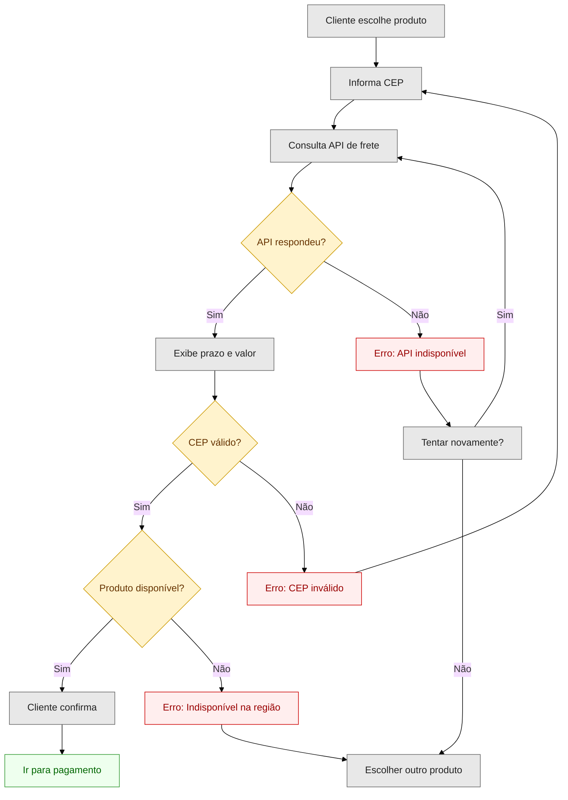
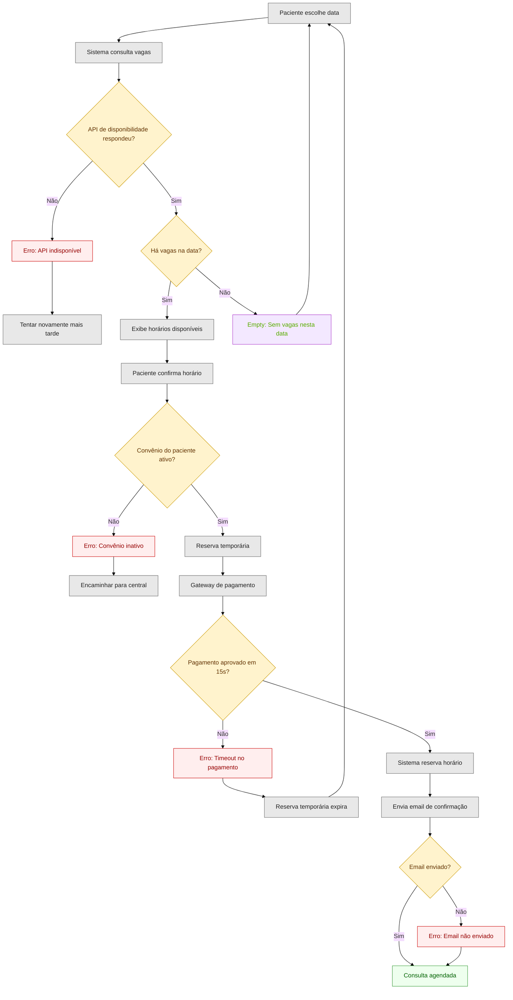
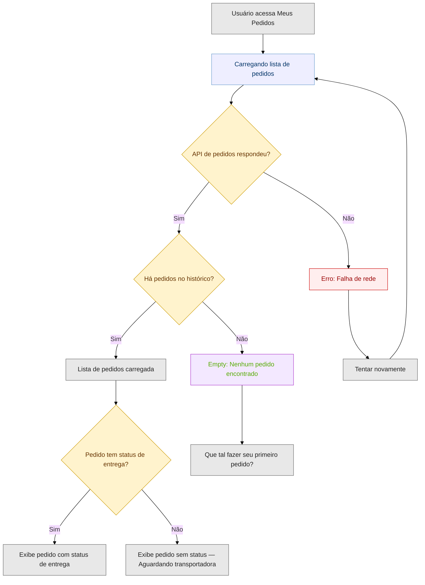
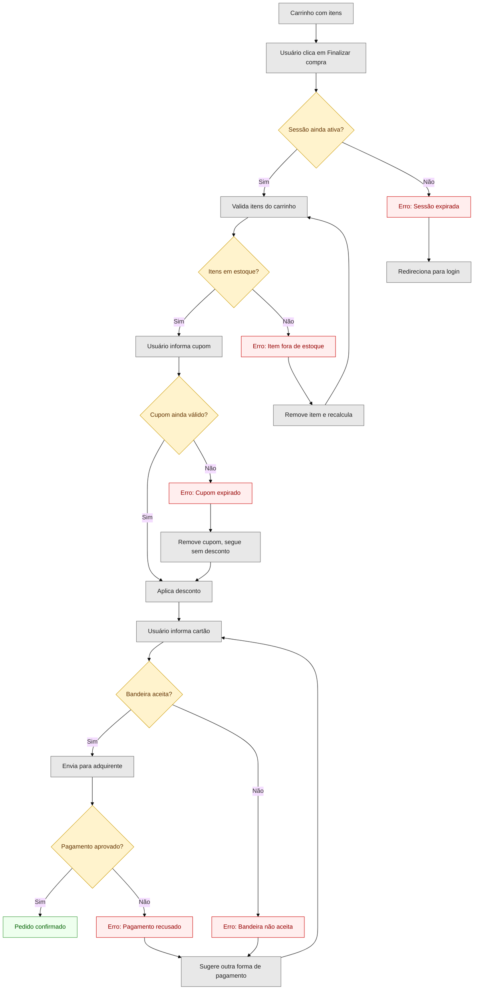

# Criar Mermaid — Fluxograma de Requisitos

Skill que traduz especificações de requisitos de software em fluxogramas Mermaid.js com cobertura completa de caminhos felizes e infelizes.

## Uso rápido

```
/criar-mermaid <especificação do fluxo>
```

Exemplo mínimo:

```
/criar-mermaid Usuário faz login. Sistema valida credenciais. Se ok, vai pro dashboard. Se não, mostra erro e link de recuperação.
```

A skill gera o código Mermaid. Cole em qualquer renderizador Mermaid (GitHub, GitLab, Notion, Mermaid Live Editor, Obsidian).

## O que a skill garante

- **Contraste legível** — todo `classDef` declara `fill` + `color` + `stroke`. O diagrama funciona em tema claro e escuro.
- **Cobertura exaustiva** — cada risco vira um nó de erro. Cada decisão tem os dois ramos rotulados.
- **Estados de UI** — loading, empty state e error feedback aparecem como nós com classe própria.
- **Sintaxe semântica** — retângulos para ações, losangos para decisões, cantos arredondados para início/fim.

## Cenários de uso

### 1. Ideia bruta (sem análise de riscos)

Você tem uma descrição informal. A skill infere os pontos de falha.

```
/criar-mermaid O cliente escolhe um produto, informa o CEP, sistema calcula frete via API dos Correios,
exibe prazo e valor. Cliente confirma e vai pro pagamento.
```

Saída: fluxograma com nós de erro para API offline, CEP inválido, produto indisponível na região.



### 2. Com análise de riscos pronta

Você já tem riscos mapeados. A skill é exaustiva — cada risco declarado aparece no diagrama.

```
/criar-mermaid Fluxo: agendamento de consulta.
Riscos:
- API de disponibilidade retorna 500
- Horário escolhido é ocupado durante o submit (concorrência)
- Paciente sem cadastro ativo no convênio
- Timeout no gateway de pagamento (15s)
- Envio de email de confirmação falha
Caminho feliz: paciente escolhe data → sistema consulta vagas → paciente confirma →
sistema reserva → envia confirmação por email.
```



### 3. Fluxo com estados de tela (UX)

Quando o foco é a experiência do usuário entre telas.

```
/criar-mermaid App de pedidos: usuário acessa "Meus Pedidos".
Estados possíveis: carregando lista, lista vazia (primeiro acesso), erro de rede,
lista com pedidos, pedido sem status de entrega.
```



### 4. Pós-PRD (validação visual)

Com user stories e edge cases já documentados.

```
/criar-mermaid PRD: Carrinho de compras.
US-03: Finalizar compra.
Edge cases:
- Item fica fora de estoque entre adicionar e finalizar
- Cupom de desconto expira durante o checkout
- Sessão do usuário expira após 30 min de inatividade
- Bandeira do cartão não aceita pela adquirente
```



### 5. Composição com outras skills

O fluxograma como etapa de validação visual entre refino e PRD:

```
1. /refinamento-demanda   → refina a demanda, identifica riscos
2. /criar-mermaid          → fluxograma com os riscos mapeados (validação visual)
3. /criar-prd              → PRD com o fluxograma como referência
```

## Paleta de cores

| Nó | Classe | Aparência |
|---|---|---|
| Erro / falha | `error` | Fundo rosa claro, texto vermelho escuro |
| Sucesso / conclusão | `success` | Fundo verde claro, texto verde escuro |
| Decisão (losango) | `decision` | Fundo amarelo claro, texto marrom |
| Ação / processo | `action` | Fundo cinza claro, texto quase preto |
| Loading / espera | `loading` | Fundo azul claro, texto azul escuro |
| Empty state / vazio | `empty` | Fundo lilás claro, texto verde oliva |
| Início / fim | `startend` | Fundo verde suave, texto verde escuro |

## Como renderizar o diagrama

O output da skill é código Mermaid puro. Você pode colar em:

- **GitHub/GitLab** — blocos de código com ` ```mermaid `
- **Mermaid Live Editor** — https://mermaid.live
- **Obsidian** — suporte nativo a blocos mermaid
- **Notion** — via integração Mermaid
- **VS Code** — extensão "Markdown Preview Mermaid Support"
- **Qualquer arquivo `.md`** — renderizadores de markdown com suporte a Mermaid

## Por que o contraste funciona

O problema comum é declarar `classDef error fill:#f96` sem `color`. O Mermaid delega a cor do texto ao tema do renderizador. Se o tema for escuro (`neutral`, `dark`), o texto padrão é cinza claro (`#ccc`) sobre um preenchimento médio — ilegível.

Esta skill resolve com duas regras fixas:

1. **`%%{init: {'theme': 'base'}}%%`** força o tema neutro, que respeita cores explícitas
2. **`fill` + `color` + `stroke` sempre juntos** — fundo claro + texto escuro = contraste garantido em qualquer plataforma
