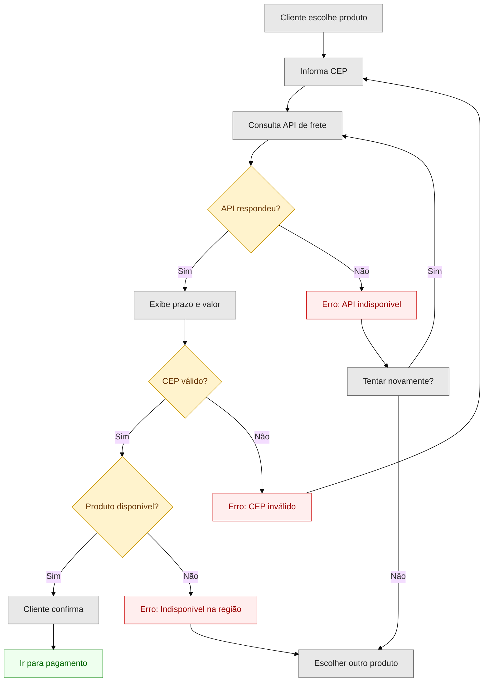
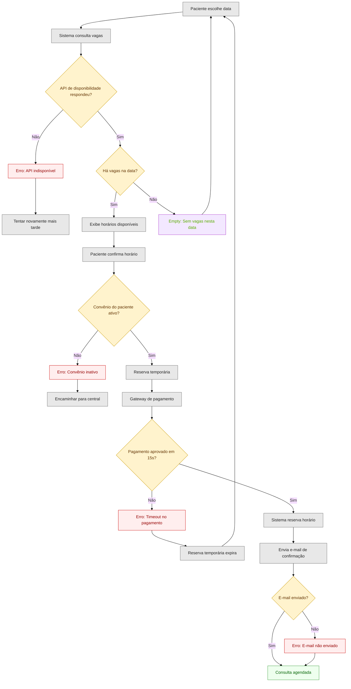
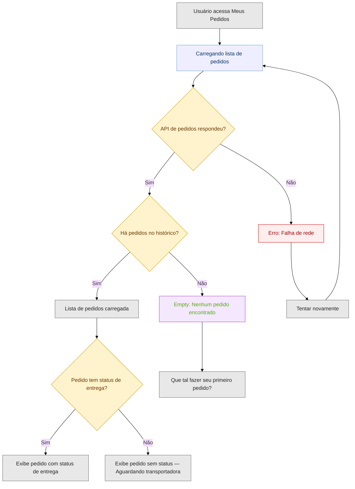
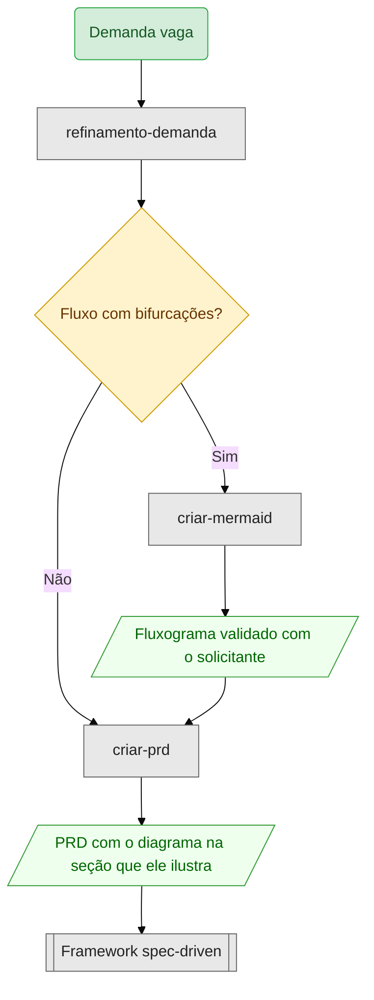

# criar-mermaid

Traduz especificação de requisitos em fluxograma Mermaid.js, cobrindo o caminho feliz e todos os caminhos de erro.

```
/criar-mermaid <especificação do fluxo>
```

O output é código Mermaid puro, pronto para colar em qualquer renderizador.

## Fluxo

```
1. Leitura do contexto
   │  atores, entrada, sequência do caminho feliz,
   │  pontos de decisão, falhas, estados de UI
   ▼
2. Geração do código
   │  nós classificados pela paleta de contraste
   ▼
3. Validação de contraste
      [ ] theme base na primeira linha
      [ ] todo classDef com fill + color + stroke
      [ ] toda decisão com as duas saídas rotuladas
      [ ] todo caminho da análise de riscos no diagrama
```

A etapa 3 é o que separa esta skill de pedir "faz um mermaid disso" para um agente qualquer: o diagrama só é entregue depois de a checklist fechar.

## Cenário 1 — ideia bruta

Você tem uma descrição informal e nenhuma análise de riscos. A skill infere os pontos de falha.

```
┌──────────────────────────────────────────────────────────────┐
│ você                                                         │
│   /criar-mermaid                                             │
│                                                              │
│   O cliente escolhe um produto, informa o CEP, o sistema     │
│   calcula frete via API dos Correios, exibe prazo e valor.   │
│   Cliente confirma e vai pro pagamento.                      │
└──────────────────────────────────────────────────────────────┘
```

Você descreveu cinco passos, todos de sucesso. O diagrama volta com API offline, CEP inválido e produto indisponível na região — falhas que a descrição não menciona e que alguém teria que tratar de qualquer forma.


```mermaid
%%{init: {'theme': 'base'}}%%
graph TD
    A[Cliente escolhe produto] --> B[Informa CEP]
    B --> C[Consulta API de frete]
    C --> D{API respondeu?}
    D -->|Sim| E[Exibe prazo e valor]
    D -->|Não| F[Erro: API indisponível]
    F --> G[Tentar novamente?]
    G -->|Sim| C
    G -->|Não| H[Escolher outro produto]
    E --> I{CEP válido?}
    I -->|Sim| J{Produto disponível?}
    I -->|Não| K[Erro: CEP inválido]
    K --> B
    J -->|Sim| L[Cliente confirma]
    J -->|Não| M[Erro: Indisponível na região]
    M --> H
    L --> N[Ir para pagamento]

classDef error fill:#fee,color:#900,stroke:#c00
classDef success fill:#efe,color:#060,stroke:#393
classDef decision fill:#fff3cd,color:#630,stroke:#c90
classDef action fill:#e8e8e8,color:#222,stroke:#666
classDef startend fill:#d4edda,color:#155724,stroke:#28a745

class F,K,M error
class N success
class D,I,J decision
class A,B,C,E,G,H,L action
```

É aqui que o fluxograma paga o investimento: ele revela o que ninguém escreveu. Cada nó vermelho é uma decisão que alguém vai tomar — no refinamento agora, ou no meio da implementação depois.

## Cenário 2 — com análise de riscos pronta

Quando os riscos já estão mapeados, a skill é exaustiva: cada risco declarado precisa aparecer no diagrama.

```
┌──────────────────────────────────────────────────────────────┐
│ você                                                         │
│   /criar-mermaid                                             │
│                                                              │
│   Fluxo: agendamento de consulta.                            │
│   Riscos:                                                    │
│   - API de disponibilidade retorna 500                       │
│   - horário ocupado durante o submit (concorrência)          │
│   - paciente sem cadastro ativo no convênio                  │
│   - timeout no gateway de pagamento (15s)                    │
│   - envio de e-mail de confirmação falha                     │
│   Caminho feliz: escolhe data → consulta vagas → confirma    │
│   → reserva → envia confirmação por e-mail                   │
└──────────────────────────────────────────────────────────────┘
```


```mermaid
%%{init: {'theme': 'base'}}%%
graph TD
    A[Paciente escolhe data] --> B[Sistema consulta vagas]
    B --> C{API de disponibilidade respondeu?}
    C -->|Sim| D{Há vagas na data?}
    C -->|Não| E[Erro: API indisponível]
    E --> F[Tentar novamente mais tarde]
    D -->|Sim| G[Exibe horários disponíveis]
    D -->|Não| H[Empty: Sem vagas nesta data]
    H --> A
    G --> I[Paciente confirma horário]
    I --> J{Convênio do paciente ativo?}
    J -->|Sim| K[Reserva temporária]
    J -->|Não| L[Erro: Convênio inativo]
    L --> M[Encaminhar para central]
    K --> N[Gateway de pagamento]
    N --> O{Pagamento aprovado em 15s?}
    O -->|Sim| P[Sistema reserva horário]
    O -->|Não| Q[Erro: Timeout no pagamento]
    Q --> R[Reserva temporária expira]
    R --> A
    P --> S[Envia e-mail de confirmação]
    S --> T{E-mail enviado?}
    T -->|Sim| U[Consulta agendada]
    T -->|Não| V[Erro: E-mail não enviado]
    V --> U

classDef error fill:#fee,color:#900,stroke:#c00
classDef success fill:#efe,color:#060,stroke:#393
classDef decision fill:#fff3cd,color:#630,stroke:#c90
classDef action fill:#e8e8e8,color:#222,stroke:#666
classDef empty fill:#f3e8ff,color:#5a0,stroke:#a3c
classDef startend fill:#d4edda,color:#155724,stroke:#28a745

class E,L,Q,V error
class U success
class C,D,J,O,T decision
class A,B,F,G,I,K,M,N,P,R,S action
class H empty
```

Duas coisas para notar. A falha do e-mail (`V`) desemboca em sucesso (`U`), porque a consulta está agendada mesmo sem o e-mail sair — o diagrama distingue falha que bloqueia de falha que só degrada. E o timeout do pagamento devolve o paciente ao início, expirando a reserva temporária: um ciclo que só fica óbvio quando desenhado.

## Cenário 3 — estados de tela

Quando o foco é a experiência entre telas, entram as classes `loading` e `empty`, que os dois cenários anteriores quase não usam.

```
/criar-mermaid App de pedidos: usuário acessa "Meus Pedidos".
Estados possíveis: carregando lista, lista vazia (primeiro acesso),
erro de rede, lista com pedidos, pedido sem status de entrega.
```


```mermaid
%%{init: {'theme': 'base'}}%%
graph TD
    A[Usuário acessa Meus Pedidos] --> B[Carregando lista de pedidos]
    B --> C{API de pedidos respondeu?}
    C -->|Sim| D{Há pedidos no histórico?}
    C -->|Não| E[Erro: Falha de rede]
    E --> F[Tentar novamente]
    F --> B
    D -->|Sim| G[Lista de pedidos carregada]
    D -->|Não| H[Empty: Nenhum pedido encontrado]
    H --> I[Que tal fazer seu primeiro pedido?]
    G --> J{Pedido tem status de entrega?}
    J -->|Sim| K[Exibe pedido com status de entrega]
    J -->|Não| L[Exibe pedido sem status — Aguardando transportadora]

classDef error fill:#fee,color:#900,stroke:#c00
classDef decision fill:#fff3cd,color:#630,stroke:#c90
classDef action fill:#e8e8e8,color:#222,stroke:#666
classDef loading fill:#eef,color:#036,stroke:#69c
classDef empty fill:#f3e8ff,color:#5a0,stroke:#a3c

class E error
class B loading
class H empty
class C,D,J decision
class A,F,G,I,K,L action
```

## Onde entra na cadeia


```mermaid
%%{init: {'theme': 'base'}}%%
graph TD
  A(Demanda vaga) --> B[refinamento-demanda]
  B --> C{Fluxo com bifurcações?}
  C -->|Sim| D[criar-mermaid]
  C -->|Não| E[criar-prd]
  D --> F[/Fluxograma validado com o solicitante/]
  F --> E
  E --> G[/PRD com o diagrama na seção que ele ilustra/]
  G --> H[[Framework spec-driven]]

  classDef success fill:#efe,color:#060,stroke:#393
  classDef decision fill:#fff3cd,color:#630,stroke:#c90
  classDef action fill:#e8e8e8,color:#222,stroke:#666
  classDef startend fill:#d4edda,color:#155724,stroke:#28a745

  class F,G success
  class C decision
  class B,D,E,H action
  class A startend
```

A skill é chamada de dois lugares além da linha de comando: o [`refinamento-demanda`](../refinamento-demanda/SKILL.md) oferece o diagrama quando a demanda tem passos sequenciais com bifurcações, e o [`criar-prd`](../criar-prd/SKILL.md) oferece quando a feature descreve fluxo visualizável. Nos dois casos o resultado é posicionado junto ao tópico que ilustra, não anexado no fim.

O ganho de gerar antes do PRD é de validação: fluxograma é o formato em que um solicitante não técnico consegue apontar "não é assim que funciona". Parágrafo de requisito, não.

## Paleta

| Nó | Classe | Aparência |
|---|---|---|
| Erro / falha | `error` | fundo rosa claro, texto vermelho escuro |
| Sucesso / conclusão | `success` | fundo verde claro, texto verde escuro |
| Decisão (losango) | `decision` | fundo amarelo claro, texto marrom |
| Ação / processo | `action` | fundo cinza claro, texto quase preto |
| Loading / espera | `loading` | fundo azul claro, texto azul escuro |
| Empty state | `empty` | fundo lilás claro, texto verde oliva |
| Início / fim | `startend` | fundo verde suave, texto verde escuro |

## Por que o contraste é regra e não estilo

O erro comum é declarar `classDef error fill:#f96` sem `color`. O Mermaid delega a cor do texto ao tema do renderizador, e num tema escuro o padrão é cinza claro sobre preenchimento médio: ilegível.

A skill fixa duas regras contra isso. `%%{init: {'theme': 'base'}}%%` na primeira linha, porque o tema `base` respeita cores explícitas em vez de injetar fundo escuro. E `fill`, `color` e `stroke` sempre declarados juntos, o que garante fundo claro com texto escuro em qualquer plataforma.

## Onde renderizar

GitHub e GitLab renderizam blocos ` ```mermaid ` direto no markdown. Fora disso: [Mermaid Live Editor](https://mermaid.live), Obsidian com suporte nativo, Notion via integração, e VS Code com a extensão "Markdown Preview Mermaid Support".

Veja as regras completas em [`SKILL.md`](SKILL.md).
