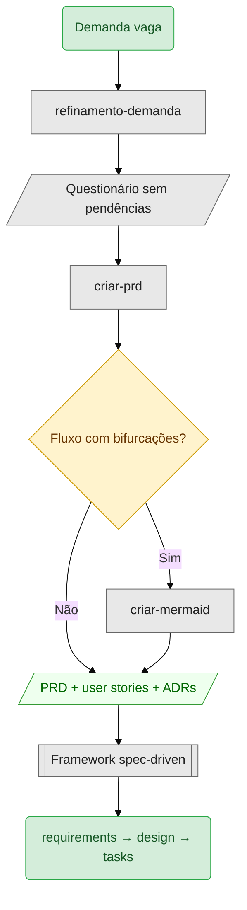

# criar-prd

Gera PRDs prontos para implementação. Você descreve uma feature, a skill entrevista você, varre o código que já existe, e entrega o PRD com catálogo de user stories e ADRs.

```
/criar-prd
```

> Melhorias desenvolvidas em conjunto com conceitos da skill `cy-create-prd`: pesquisa de codebase, business focus, ADRs separados, catálogo de user stories, update mode.

## Quando usar

Você tem uma ideia de feature e precisa de uma spec que qualquer dev — ou qualquer agente — consiga implementar sem voltar a perguntar. Serve para pedidos como "preciso de notificações push no app" ou "o cliente quer um portal do professor com lançamento de notas".

A skill cria a spec. Se você ainda está descobrindo o que perguntar, o passo anterior é o [`refinamento-demanda`](../refinamento-demanda/SKILL.md).

## Fluxo

```
   ┌──────────────────────────────────────────────────────────┐
   │  0. Detecta modo        → novo PRD ou update             │
   │  1. Análise de escopo   → um PRD ou vários?              │
   └──────────────────────────┬───────────────────────────────┘
                              │
   ┌──────────────────────────▼───────────────────────────────┐
   │  2a. Codebase           → sempre, se o repo for visível  │
   │  2b. Mercado            → só com autorização             │
   │  2c. Apresenta achados  → antes de qualquer pergunta     │
   └──────────────────────────┬───────────────────────────────┘
                              │
   ┌──────────────────────────▼───────────────────────────────┐
   │  3. Métricas (opcional)                                  │
   │  4. Análise inicial     → mapeia lacunas                 │
   │  5. Entrevista          → 10 dimensões, uma por vez      │
   │  6. ADRs                → uma decisão por arquivo        │
   └──────────────────────────┬───────────────────────────────┘
                              │
   ┌──────────────────────────▼───────────────────────────────┐
   │  7. Geração                                              │
   │  8. Revisão             → itera até aprovação            │
   └──────────────────────────────────────────────────────────┘
```

A ordem das perguntas da entrevista está em [`references/question-order.md`](references/question-order.md): contexto, problema, solução, funcionalidades, decisões, escopo negativo, critérios de aceite, milestones, riscos e referências.

## Cenário 1 — feature única

Notificações push num app que já tem serviço de e-mail.

```
┌──────────────────────────────────────────────────────────────┐
│ você                                                         │
│   /criar-prd                                                 │
│                                                              │
│   Preciso de notificações push no app. O usuário recebe      │
│   alerta quando tem nova mensagem, nova curtida e quando     │
│   alguém menciona ele.                                       │
├──────────────────────────────────────────────────────────────┤
│ agente                          ◄── varredura de codebase    │
│   Antes das perguntas, o que encontrei:                      │
│                                                              │
│   • NotificationService já existe, com suporte a e-mail      │
│   • Firebase Cloud Messaging configurado no Android          │
│   • user_preferences já tem notifications_enabled            │
│   • o WebSocket do chat pode servir de fallback              │
│                                                              │
│   Com base nisso, vou focar no que diferencia sua feature.   │
└──────────────────────────────────────────────────────────────┘
```

A varredura vem antes da entrevista de propósito: perguntar "vocês já têm serviço de notificação?" quando a resposta está no repositório queima a paciência de quem responde.

```
┌──────────────────────────────────────────────────────────────┐
│ agente                          ◄── business focus           │
│   Quando vários eventos chegam em sequência, cinco curtidas  │
│   na mesma foto:                                             │
│   A) uma notificação por evento                              │
│   B) agregar em "João e mais 4 curtiram"  (recomendado)      │
│   C) o usuário escolhe nas preferências                      │
├──────────────────────────────────────────────────────────────┤
│ você                                                         │
│   B                                                          │
├──────────────────────────────────────────────────────────────┤
│ agente                                                       │
│   B, agregado. Isso implica que não precisamos de            │
│   configuração granular por tipo de evento, o que simplifica │
│   a tela de preferências. Registro como ADR.                 │
└──────────────────────────────────────────────────────────────┘
```

Repare no formato da pergunta: nada sobre fila, worker ou payload. A skill traduz decisão de implementação em decisão de experiência, e a arquitetura decorre disso.

No fim, os arquivos:

```
tasks/notificacoes-push/
├── _prd.md              → 9 seções, 5 user stories, 4 milestones
├── _user_stories.md     → cada US com rules e edge cases
└── adrs/
    ├── adr-001.md       → agregação de notificações por entidade
    └── adr-002.md       → Firebase com WebSocket como fallback
```

## Cenário 2 — mais de uma feature, e um PRD que já existe

Aqui aparecem os dois desvios do fluxo: a divisão de escopo e o update mode.

```
┌──────────────────────────────────────────────────────────────┐
│ você                                                         │
│   /criar-prd                                                 │
│                                                              │
│   Portal do professor: lançamento de notas, registro de      │
│   frequência e emissão de relatórios para a coordenação.     │
├──────────────────────────────────────────────────────────────┤
│ agente                          ◄── análise de escopo        │
│   Isso me parece mais de uma feature independente. Sugiro    │
│   dividir em:                                                │
│                                                              │
│   • PRD 1: lançamento de notas — entrega e testa sozinho     │
│   • PRD 2: registro de frequência — modelo de dados próprio  │
│   • PRD 3: relatórios da coordenação — outra persona         │
│                                                              │
│   Faço um PRD por vez. Qual quer que eu comece?              │
├──────────────────────────────────────────────────────────────┤
│ você                                                         │
│   começa pelo 1                                              │
└──────────────────────────────────────────────────────────────┘
```

O critério de divisão não é tamanho: é entregar e testar em separado, afetar módulos diferentes, atender personas distintas, ou passar de seis ou sete user stories.

Semanas depois, a coordenação pede que o professor possa reabrir uma nota já lançada:

```
┌──────────────────────────────────────────────────────────────┐
│ você                                                         │
│   /criar-prd                                                 │
│                                                              │
│   No lançamento de notas, o professor precisa poder reabrir  │
│   uma nota já fechada, com justificativa.                    │
├──────────────────────────────────────────────────────────────┤
│ agente                          ◄── update mode              │
│   Encontrei um PRD existente em tasks/lancamento-notas/.     │
│   Quer atualizá-lo ou criar um novo?                         │
├──────────────────────────────────────────────────────────────┤
│ você                                                         │
│   atualiza                                                   │
├──────────────────────────────────────────────────────────────┤
│ agente                                                       │
│   Vou preservar as seções não afetadas e espelhar a mudança  │
│   no _user_stories.md. A US-04 ganha um edge case novo:      │
│   reabertura depois do fechamento do período letivo.         │
└──────────────────────────────────────────────────────────────┘
```

Sem o update mode, o caminho comum é gerar um segundo PRD e deixar dois documentos concorrentes descrevendo a mesma feature.

## O que ela gera

| Arquivo | Para quem | Conteúdo |
|---|---|---|
| `_prd.md` | tech lead, dev, agente | contexto, user stories, edge cases, escopo negativo, milestones, riscos |
| `_user_stories.md` | dev, agente | catálogo com acceptance criteria e edge cases varridos |
| `adrs/adr-NNN.md` | time, e o time do ano que vem | decisões arquiteturais registradas, referenciáveis por outros PRDs |

Os milestones são de 3 a 6, independentes, e cada um carrega condição de conclusão, forma de verificação e quem aprova. Métricas são opcionais: se você pedir, os critérios de aceite saem numéricos com baseline e fonte; se não, ficam técnicos.

## Onde entra na cadeia



A skill aproveita blocos Mermaid que vierem no input em vez de descartá-los, e oferece gerar um quando a feature descreve fluxo visualizável. O diagrama vai para a seção do PRD que ele ilustra.

Veja o fluxo completo em [`SKILL.md`](SKILL.md).
