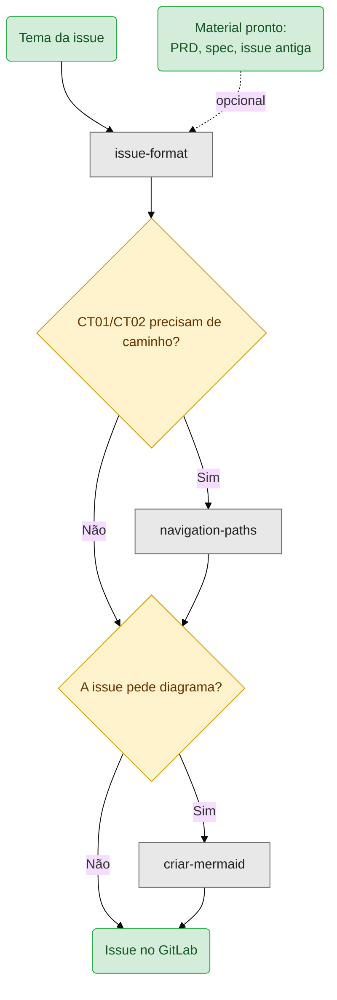

# issue-format

Escreve issue no padrão do projeto: história de usuário, critérios de aceitação agrupados, sugestão de notificação e casos de teste CT01/CT02.

```
/issue-format
```

Antes de redigir, a skill entrevista. Uma pergunta por vez, e nenhuma issue sai com dúvida em aberto.

Para converter uma spec inteira em várias issues, o caminho é a `spec-para-issues`. Esta skill é para issue avulsa, ou para reescrever issue antiga no padrão atual.

## O que ela procura no seu projeto

A skill trabalha sobre o projeto onde as issues estão sendo escritas, não sobre a pasta dela. Na raiz desse projeto ela busca:

| Arquivo | Uso | Se faltar |
|---|---|---|
| `perfis.md` | perfis padronizados, apresentados como múltipla escolha | pergunta e cria o arquivo ao final |
| `caminhos.md` | caminho de navegação para os casos de teste | usa [`navigation-paths`](../navigation-paths/SKILL.md) ou pergunta |
| issues anteriores | tom e padrão do projeto | segue só o template |
| `.env` com `GITLAB_URL` e `PROJECT_ID` | compor o `src` do protótipo | pergunta os valores |

Nenhum desses é obrigatório. A skill degrada perguntando, em vez de inventar.

## Fluxo

```
1. Perfis de acesso
   │  múltipla escolha a partir de perfis.md
   ▼
2. Informação de apoio
   ▼
3. Artefatos externos
   │  link do template de PDF, quadro de exemplo para CSV
   ▼
4. Caça à informação órfã
   │  informação nova criada tem issue de consumo?
   ▼
5. Redação
   │  template + protótipo com src resolvido
   ▼
6. Critérios de aceitação
   │  agrupados, renumerados por grupo,
   │  notificação aninhada onde houver mensagem
   ▼
7. Casos de teste
   │  CT01 e CT02, cada critério coberto
   ▼
8. Fechamento
   │  referência cruzada #nr, perfis.md, nomenclatura
   ▼
9. Verificação por 5 subagentes
      critérios das etapas 1 a 8 divididos entre eles
```

## Cenário 1 — issue nova

Um campo novo no cadastro de edital.

```
┌──────────────────────────────────────────────────────────────┐
│ você                                                         │
│   /issue-format                                              │
│                                                              │
│   Preciso de uma issue pra adicionar o campo "Formulário     │
│   Personalizado" no cadastro de editais.                     │
│                                                              │
│   (opcional) material de apoio, se você tiver:               │
│   - #tasks/editais/_prd.md                                   │
│   - #tasks/editais/_user_stories.md                          │
│   - ata da reunião com a Pró-Reitoria em anexo               │
│   - fonte em ~/git/sigaa, módulo de editais                  │
├──────────────────────────────────────────────────────────────┤
│ agente                          ◄── perfis.md                │
│   Quais perfis terão acesso a essa funcionalidade?           │
│   1. Administrador                                           │
│   2. Gestor de Editais                                       │
│   3. Coordenador de Curso                                    │
│   4. Candidato                                               │
│                                                              │
│   Se o perfil que você precisa não está na lista, me diz.    │
├──────────────────────────────────────────────────────────────┤
│ você                                                         │
│   2                                                          │
└──────────────────────────────────────────────────────────────┘
```

O material de apoio é opcional e cada tipo poupa um trecho da entrevista: PRD e user stories já trazem critérios e edge cases, a ata cobre a regra de negócio e quem decidiu, e o caminho do fonte permite a skill conferir nomes de campo e menu em vez de perguntar. Sem nada disso a skill funciona igual, só pergunta mais.

A lista de perfis sai do `perfis.md` do projeto. Perfil informado fora dela é registrado e entra no arquivo no fechamento, o que evita o `perfis.md` envelhecer em silêncio.

Depois das perguntas de apoio, vem a etapa que mais pega problema:

```
┌──────────────────────────────────────────────────────────────┐
│ agente                          ◄── caça à informação órfã   │
│   Essa issue cria uma informação nova: o campo "Formulário   │
│   Personalizado" no cadastro administrativo.                 │
│                                                              │
│   Existe issue para o fluxo em que o candidato preenche      │
│   esse formulário durante a inscrição?                       │
├──────────────────────────────────────────────────────────────┤
│ você                                                         │
│   não, não tinha pensado nisso                               │
├──────────────────────────────────────────────────────────────┤
│ agente                                                       │
│   Sugiro uma issue complementar para o consumo do campo na   │
│   inscrição. Registro como pendência nesta e escrevemos a    │
│   complementar depois, ou prefere que eu já proponha o       │
│   título e o perfil dela?                                    │
└──────────────────────────────────────────────────────────────┘
```

É o padrão de falha mais comum em backlog de sistema: a issue que **cria** o dado entra, a issue que **usa** o dado não. O campo é desenvolvido, entregue, e nunca aparece para o usuário final.

Os critérios saem agrupados, com a notificação aninhada:

```markdown
## 2. Validação do formulário

* **CA 01:** o sistema aceita apenas formulários com pelo menos um campo
* **CA 02:** ao salvar sem campo definido, o cadastro é bloqueado
    > **Sugestão de notificação (bloqueio ao salvar):**
    > - **Tipo:** alerta inline abaixo do seletor
    > - **Conteúdo:** "Defina ao menos um campo antes de salvar."
    > - **Comportamento:** aparece ao submeter, permanece até o ajuste
```

A sugestão de notificação existe para o desenvolvedor não inventar o texto do alerta. Sem ela, cada dev escreve o seu, e a interface fica com cinco vozes diferentes.

## Cenário 2 — padronizar issue antiga

Aqui aparecem a referência cruzada e a verificação por subagentes.

```
┌──────────────────────────────────────────────────────────────┐
│ você                                                         │
│   /issue-format                                              │
│                                                              │
│   Reescreve essa issue antiga no padrão atual: [texto]       │
├──────────────────────────────────────────────────────────────┤
│ agente                          ◄── referência cruzada       │
│   O texto menciona "conforme issue 5.1" e "depende das       │
│   issues 5.2 e 5.3". Referência funcional não gera link      │
│   automático no GitLab.                                      │
│                                                              │
│   Você tem os números? Se não, consulta e me passa — não     │
│   fecho a issue com o número em branco.                      │
├──────────────────────────────────────────────────────────────┤
│ você                                                         │
│   5.1 é a #7, 5.2 é a #8 e 5.3 é a #9                        │
├──────────────────────────────────────────────────────────────┤
│ agente                                                       │
│   Aplicado: issue 5.1 (#7), issues 5.2 (#8) e 5.3 (#9).      │
│   A leitura funcional continua, e o GitLab passa a linkar.   │
└──────────────────────────────────────────────────────────────┘
```

Com o texto pronto, a skill não entrega direto:

```
┌──────────────────────────────────────────────────────────────┐
│ agente                          ◄── 5 subagentes             │
│   Critérios das Etapas 1 a 8, conferidos contra a issue:     │
│                                                              │
│   ATENDIDO          5                                        │
│   NÃO SE APLICA     2  → link de PDF, quadro CSV             │
│   DÚVIDA            1  → CT02 cobre o CA 02 do grupo 2?      │
│                                                              │
│   Os dois "não se aplica" fazem sentido para você, ou algum  │
│   deveria ter sido tratado?                                  │
└──────────────────────────────────────────────────────────────┘
```

O ponto do desenho é o "não se aplica" voltar para você em vez de ser aceito. Subagente que conclui que um critério não se aplica está emitindo hipótese, e é justamente aí que verificação passa batido.

## O que ela gera

Issue em markdown pronta para colar no GitLab, seguindo [`assets/issue-template.md`](assets/issue-template.md): cabeçalho com número, versão e perfil, história de usuário, objetivo do usuário e de negócio, critérios agrupados com notificações, bloco de protótipo, informações de apoio, quadro de exemplo quando houver CSV ou relatório, e CT01/CT02.

Quando falta informação, vem acompanhada de lista curta de pendências, incluindo as órfãs identificadas na Etapa 4.

## Independência e acoplamento

A skill roda sozinha. O caminho normal é você descrever o tema e ela entrevistar do zero — nenhum documento anterior é necessário.

Ela chama outras duas skills, as duas condicionais: a [`navigation-paths`](../navigation-paths/SKILL.md) quando os casos de teste precisam de perfil, login e caminho para ficarem reproduzíveis, e a [`criar-mermaid`](../criar-mermaid/SKILL.md) quando a issue pede diagrama de fluxo.



Material pronto encurta a entrevista, não a substitui: vindo de uma issue antiga para padronizar, sobra perguntar o que o padrão atual exige e o texto antigo não tem.

Veja o fluxo completo em [`SKILL.md`](SKILL.md).
