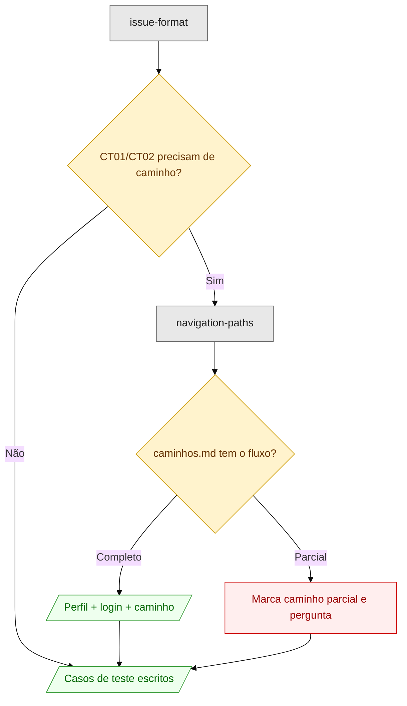

# navigation-paths

Responde o caminho para chegar numa funcionalidade, com perfil recomendado e credenciais sugeridas.

```
/navigation-paths
```

Serve para três pedidos: como chegar numa tela, qual perfil acessa uma funcionalidade, e roteiro de navegação para teste.

## Fonte de verdade

O arquivo **`caminhos.md` na raiz do projeto** onde a navegação está sendo mapeada — não na pasta da skill.

A skill lê antes de responder e não improvisa menu. Se o projeto não tem `caminhos.md`, ela diz isso e pergunta, porque caminho de navegação inventado é pior que caminho ausente: o inventado parece verificado.

## Formato do caminho

```
Entrar -> Menu -> Submenu -> Ação
```

Nomes de menu como aparecem no projeto, sem traduzir nem abreviar. Valor variável entra como marcador: `[parâmetro]`, `[identificador]`, `[registro]`.

## Cenário 1 — caminho mapeado

```
┌──────────────────────────────────────────────────────────────┐
│ você                                                         │
│   /navigation-paths                                          │
│                                                              │
│   Como o gestor chega na tela de homologação de inscrições?  │
├──────────────────────────────────────────────────────────────┤
│ agente                                                       │
│   Perfil recomendado                                         │
│   - Usuário: Gestor de Editais                               │
│   - Login: gestor.editais                                    │
│   - Senha: não informado                                     │
│                                                              │
│   Caminho de navegação                                       │
│   Entrar -> Editais -> [edital] -> Inscrições -> Homologar   │
│                                                              │
│   Observações                                                │
│   - Variáveis: [edital]                                      │
│   - Dependências: permissão de homologação no campus         │
└──────────────────────────────────────────────────────────────┘
```

A senha sai como `não informado` em vez de um valor plausível. Credencial inventada num caso de teste custa a alguém uma tentativa de login e uma abertura de chamado.

## Cenário 2 — caminho parcial

Quando o `caminhos.md` cobre o começo do fluxo e para no meio.

```
┌──────────────────────────────────────────────────────────────┐
│ você                                                         │
│   /navigation-paths                                          │
│                                                              │
│   Caminho para o relatório de bolsas por campus              │
├──────────────────────────────────────────────────────────────┤
│ agente                                                       │
│   Caminho de navegação                                       │
│   Entrar -> Assistência -> Relatórios -> [caminho parcial]   │
│                                                              │
│   Observações                                                │
│   - O caminhos.md registra até "Relatórios". A partir daí    │
│     não há mapeamento para o relatório por campus.           │
│   - Você sabe o submenu, ou prefere que eu registre como     │
│     caminho parcial na resposta?                             │
└──────────────────────────────────────────────────────────────┘
```

O marcador `caminho parcial` é explícito de propósito. Um caminho que termina sem aviso lê como caminho completo, e quem for testar descobre a lacuna no meio do teste.

## Formato de saída

Três blocos, nesta ordem, conforme [`assets/path-response-template.md`](assets/path-response-template.md): perfil recomendado com login e senha, caminho de navegação, e observações com variáveis e dependências.

## Onde entra na cadeia

A skill é chamada de dois lugares: direto por você, ou pela [`issue-format`](../issue-format/SKILL.md) quando os casos de teste CT01 e CT02 precisam de perfil, login e caminho para ficarem reproduzíveis.



Veja as regras completas em [`SKILL.md`](SKILL.md).
