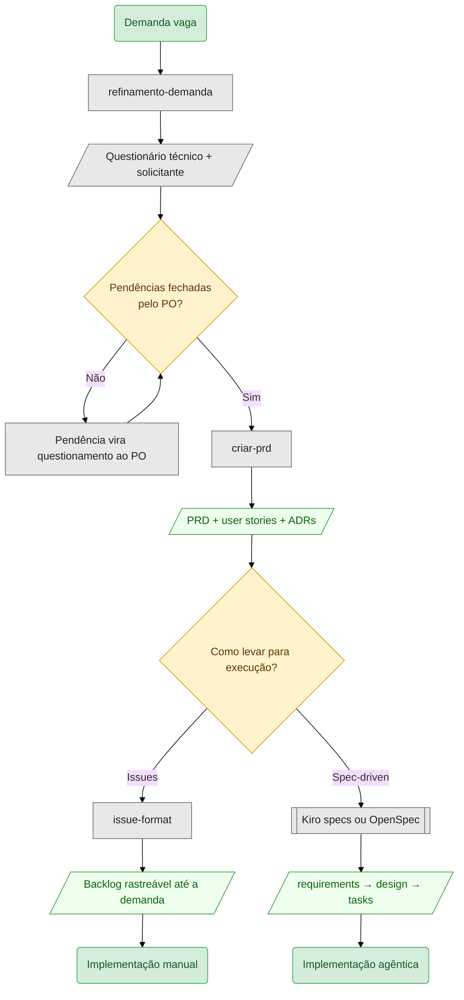

# refinamento-demanda

Transforma demandas vagas em questionários estruturados (técnico + solicitante).

```
/refinamento-demanda
```

A skill conduz 12 etapas, uma pergunta por vez. A primeira escolhe a profundidade:

- **Padrão** — questionário estruturado, respostas aceitas como vêm.
- **Sabatina** — toda resposta vaga é sondada antes de seguir, com varredura de código, glossário de domínio e mapa de dependências entre decisões. Mecânica em [`references/sabatina.md`](references/sabatina.md).

## Fluxo

```
                              ┌─────────────────────┐
                              │ 1. Profundidade     │
                              └──────┬───────┬──────┘
                            padrão ◄─┘       └─► sabatina
                                 │               │
                                 │        ┌──────▼──────────────┐
                                 │        │ 3. Varredura de     │
                                 │        │    código           │
                                 │        └──────┬──────────────┘
                                 ▼               ▼
   ┌───────────────────────────────────────────────────────────┐
   │  2. Fontes de conhecimento                                │
   │  4. Base de issues                                        │
   │  5. Formato de saída                                      │
   │  6. Recebimento da demanda                                │
   │  7. Espelho de entendimento                               │
   │  8. Consulta às fontes    → ✅ ❌ ⚠️ ❓ por premissa         │
   │  9. Perguntas de refinamento  ← 15 dimensões + detectores │
   │ 10. Diagrama de fluxo (opcional)                          │
   └───────────────────────────┬───────────────────┬───────────┘
                               │                   │
                        padrão ▼          sabatina ▼
                               │        ┌──────────────────────┐
                               │        │ 11. Confirmação      │
                               │        │     final            │
                               │        └──────────┬───────────┘
                               ▼                   ▼
                              ┌─────────────────────┐
                              │ 12. Geração         │
                              │  _tecnico.md        │
                              │  _solicitante.md    │
                              └─────────────────────┘
```

As etapas 3 e 11 só existem em sabatina. Todas as outras rodam nos dois modos.

## Cenário 1 — modo padrão

Demanda curta, solicitante com as respostas na ponta da língua.

```
┌──────────────────────────────────────────────────────────────┐
│ você                                                         │
│   /refinamento-demanda                                       │
├──────────────────────────────────────────────────────────────┤
│ agente                                                       │
│   Refinamento padrão ou sabatina?                            │
├──────────────────────────────────────────────────────────────┤
│ você                                                         │
│   padrão                                                     │
├──────────────────────────────────────────────────────────────┤
│ agente                                                       │
│   Existe alguma fonte que eu possa consultar pra validar     │
│   as suposições da demanda?                                  │
├──────────────────────────────────────────────────────────────┤
│ você                                                         │
│   o repositório do SIGAA, em ~/git/sigaa                     │
└──────────────────────────────────────────────────────────────┘
```

Segue a coleta: base de issues, formato de saída, e o texto da demanda. Você cola:

> "Adicionar um campo de observação na tela de inscrição em monitoria, igual ao que já tem na assistência estudantil."

O agente espelha o entendimento, você confirma, e ele varre as fontes:

```
┌──────────────────────────────────────────────────────────────┐
│ agente                                                       │
│   Premissas verificadas:                                     │
│                                                              │
│   ⚠️  "igual ao que já tem na assistência estudantil"        │
│       existe, mas lá o campo é obrigatório e tem limite      │
│       de 500 caracteres                                      │
│                                                              │
│   Sobre o campo de observação:                               │
│   A) obrigatório, como na assistência                        │
│   B) opcional  (recomendado)                                 │
│   C) outra, descreva                                         │
│                                                              │
│   Qual se aproxima mais?                                     │
└──────────────────────────────────────────────────────────────┘
```

Repare no que a varredura mudou: sem ela, "igual ao que já tem" viraria requisito sem ninguém conferir, e a divergência de obrigatoriedade apareceria no desenvolvimento.

Você escolhe B, responde as perguntas restantes sobre limite de caracteres e quem vê o campo, e a skill gera os dois arquivos.

## Cenário 2 — modo sabatina

Demanda longa, e o solicitante repassou o pedido de outra pessoa. É onde a sabatina paga.

```
┌──────────────────────────────────────────────────────────────┐
│ você                                                         │
│   /refinamento-demanda    → sabatina                         │
├──────────────────────────────────────────────────────────────┤
│ agente                                                       │
│   Sobre quem homologa a inscrição:                           │
│   A) coordenador do curso  (recomendado)                     │
│   B) comissão do edital                                      │
│   C) outra, descreva                                         │
├──────────────────────────────────────────────────────────────┤
│ você                                                         │
│   funciona igual ao sistema de bolsas do SIGA antigo         │
├──────────────────────────────────────────────────────────────┤
│ agente                          ◄── sondagem                 │
│   O SIGA antigo não está entre as fontes que você me passou  │
│   — tenho só o repositório do SIGAA. Você consegue           │
│   descrever como a homologação funciona lá? Quem saberia?    │
│   Se não houver como resolver agora, registro como           │
│   pergunta em aberto e marco a comparação como ❓.           │
├──────────────────────────────────────────────────────────────┤
│ você                                                         │
│   é o coordenador que aprova lá, confirmei com a             │
│   Pró-Reitoria. E se ele negar, volta pra comissão revisar   │
└──────────────────────────────────────────────────────────────┘
```

Duas coisas dispararam ao mesmo tempo nessa resposta: **comparação sem definição** e **referência a "existente" não verificável**, os dois detectores de [`references/detectores.md`](references/detectores.md).

No modo padrão a comparação entraria no arquivo marcada ❓ e a conversa seguiria. Honesto, mas empurra a descoberta para o desenvolvimento. A sondagem custou uma mensagem e transformou uma referência que ninguém podia checar em decisão explícita.

A resposta dispara mais duas coisas na mesma etapa:

```
┌──────────────────────────────────────────────────────────────┐
│ agente                          ◄── dependências             │
│   Ok, coordenador homologa. Isso impacta as perguntas        │
│   sobre segunda instância — já respondida — e sobre          │
│   recurso. Ajusto e sigo.                                    │
├──────────────────────────────────────────────────────────────┤
│ agente                          ◄── revarredura              │
│   Sua resposta trouxe "volta pra comissão revisar", que      │
│   não estava na demanda:                                     │
│                                                              │
│   Sobre o reenvio à comissão:                                │
│   A) prazo próprio de 5 dias                                 │
│   B) herda o prazo do edital  (recomendado)                  │
│   C) outra, descreva                                         │
└──────────────────────────────────────────────────────────────┘
```

Uma resposta encurtou a fila de perguntas por um lado e aumentou por outro. É a diferença entre as duas: **dependências** ajusta o que já estava na fila, **revarredura** abre o que não existia.

Ao final, antes de escrever qualquer arquivo:

```
┌──────────────────────────────────────────────────────────────┐
│ agente                          ◄── confirmação final        │
│   Antes de gerar os arquivos, confirma o resumo:             │
│                                                              │
│   Decisões tomadas (11)                                      │
│   Perguntas em aberto (2)                                    │
│   Sabatina: 4 lacunas sondadas, 3 viraram decisão            │
│   Glossário (6 termos)                                       │
│   Premissas: 2 confirmadas, 1 refutada, 1 parcial            │
│   Varredura de código: executada                             │
│                                                              │
│   Gero os arquivos?                                          │
└──────────────────────────────────────────────────────────────┘
```

Se o solicitante travar de verdade, o **freio** entra no terceiro "não sei" seguido: a sondagem para, as lacunas restantes vão para o arquivo como perguntas em aberto, e o refinamento não vira interrogatório.

## Saída

Dois arquivos, sempre:

| Arquivo | Público | Conteúdo |
|---|---|---|
| `<slug>_tecnico.md` | equipe | premissas verificadas, decisões, estrutura de issues, estimativa. Em sabatina, mais glossário e mapa de dependências |
| `<slug>_solicitante.md` | quem pediu | linguagem acessível, wireframes, sem jargão |

## Depois do refinamento

O refinamento entrega questionamento, não solução. O passo seguinte só faz sentido quando as **perguntas em aberto** do arquivo técnico foram fechadas pelo product owner — enquanto houver pendência, qualquer documento construído sobre ela carrega a lacuna adiante.

Com as pendências sanadas, o insumo está pronto para a [`criar-prd`](../criar-prd/SKILL.md):

```
┌──────────────────────────────────────────────────────────────┐
│ você                                                         │
│   /criar-prd                                                 │
│                                                              │
│   Segue o questionário do refinamento-demanda, já revisado   │
│   pelo PO e sem pendências:                                  │
│   #questionamentos/monitoria-observacao/monitoria_tecnico.md │
└──────────────────────────────────────────────────────────────┘
```

Mencionar a origem importa: a `criar-prd` trata input vindo do refinamento de forma diferente, porque premissas já verificadas não voltam para a fila de perguntas.

O que sai desse passo:

```
tasks/<slug>/
├── _prd.md              → problema, escopo, fora do escopo,
│                          critérios de aceite, 3-6 milestones
├── _user_stories.md     → cada US com acceptance criteria,
│                          regras e edge cases
└── adrs/
    ├── adr-001.md       → uma decisão arquitetural por arquivo
    └── ...
```

Se a demanda contiver mais de uma feature independente, a `criar-prd` propõe a divisão e trabalha **um PRD por vez** até aprovação.

## Encaminhando os PRDs

Do PRD saem dois caminhos para a execução: virar issues, ou entrar num framework spec-driven como as specs do Kiro (requirements → design → tasks) ou o OpenSpec (explore → propose → apply → archive). A cadeia completa fica assim:



Os dois caminhos partem do mesmo material e terminam em modos de implementação diferentes: a issue é escrita para um desenvolvedor implementar à mão, a spec é escrita para um agente implementar a partir das tasks.

Com **issues**, a [`issue-format`](../issue-format/SKILL.md) entrevista você e escreve cada uma no padrão do projeto. Ela funciona sem nada disso, mas o PRD entra como material de apoio e encurta a entrevista: a estrutura de issues proposta já traz ordem, dependência e complexidade, e cada user story já vem com acceptance criteria e edge cases.

Com **spec-driven**, o PRD alimenta a fase de requisitos direto. O ganho de chegar lá com esse material pronto está em onde a ambiguidade se paga.

Framework spec-driven deriva requisitos do que você entrega. Ambiguidade que sobrevive até ali não desaparece: ela é **resolvida por inferência do agente**, em silêncio, e vira decisão de design. Depois as tarefas são geradas sobre essa decisão inventada. Quando o erro aparece, ele já está espalhado por três camadas.

Entrar com refinamento e PRD feitos muda onde o custo cai. Fechar "quem homologa" numa conversa custa uma mensagem; descobrir isso na fase de tasks custa retrabalho de design e de código.

Muda também quem decide. O arquivo técnico lista as pendências e o PO fecha cada uma, então o framework recebe decisão tomada em vez de lacuna para preencher sozinho. E user story com acceptance criteria já é quase o formato que a fase de requisitos espera, o que encurta a tradução entre o que o solicitante pediu e o que a spec descreve.

Sem essa cadeia, o caminho usual é entregar a demanda crua ao framework e usar a fase de requisitos como refinamento improvisado — sem detectores de vaguidade, sem verificação de premissas contra o código, e sem o registro de quem decidiu o quê.

Veja o fluxo completo em [`SKILL.md`](SKILL.md).
